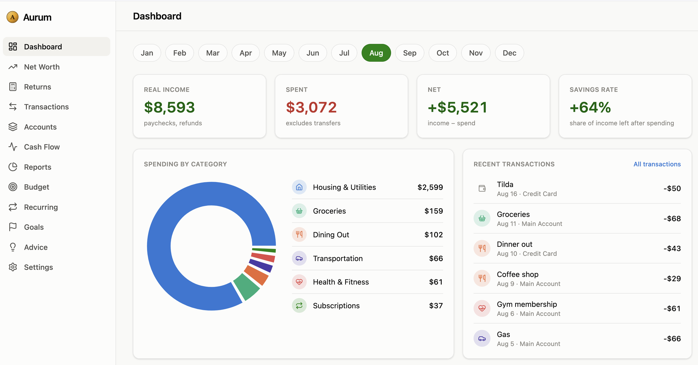
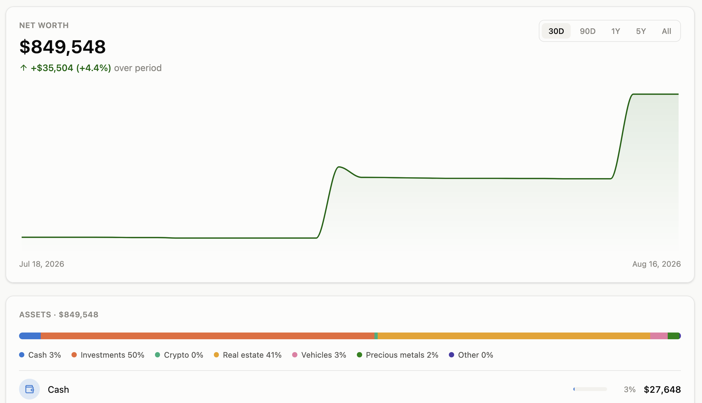
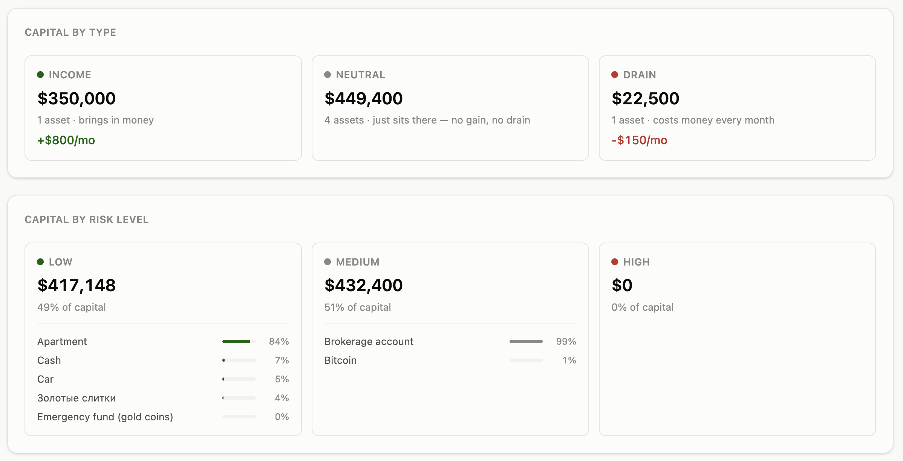
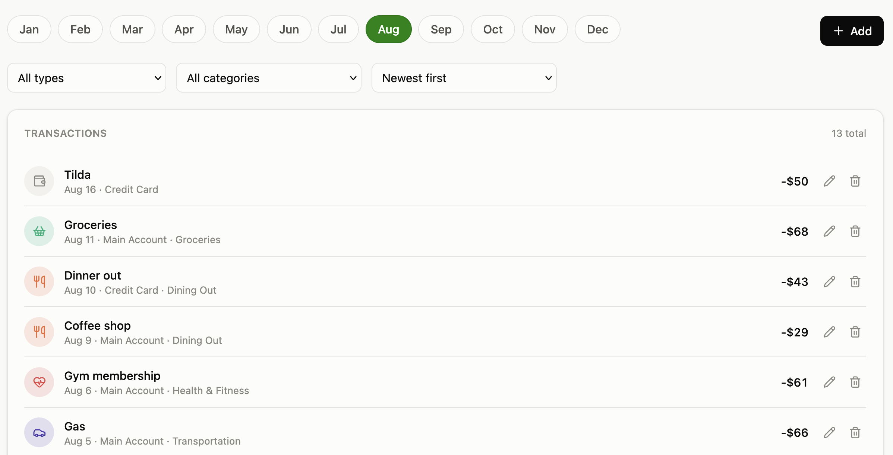
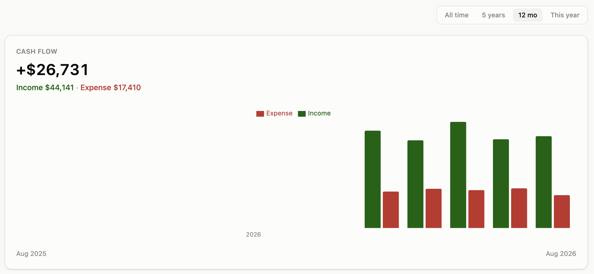
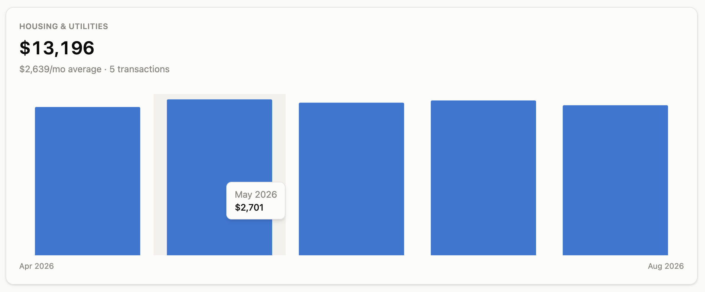

<div align="center">

# FinOS

**See where every dollar comes from. Know where every dollar goes.**

FinOS is a source-available personal finance operating system — a complete, granular, real-time picture of your money: cash flow, net worth, budgets, subscriptions, assets, and every income stream you own.

[](LICENSE)
[](CONTRIBUTING.md)

[Features](#-core-features) • [Screenshots](#-screenshots) • [Getting Started](#-getting-started) • [API Docs](DOCS.md) • [Security](#-security--self-hosting) • [Contributing](#-contributing) • [License](#-license)

</div>

## 🖼️ Screenshots

<div align="center">



<br /><br />



<br /><br />

<table>
<tr>
<td width="50%"></td>
<td width="50%"></td>
</tr>
<tr>
<td width="50%"></td>
<td width="50%"></td>
</tr>
</table>

</div>

---

## 📖 Overview

Most finance apps show you a pie chart of last month's spending and call it a day. **FinOS goes further.**

It's built for people who don't just want to **log** transactions — they want to understand the **mechanics** of their money: how capital grows or shrinks over time, which assets are pulling their weight, which subscriptions are quietly draining them, and which income streams are actually passive versus which just look that way on paper.

FinOS treats your financial life as a **system**, not a spreadsheet.

## 💡 Why FinOS

- **Fragmentation is the enemy.** Bank apps, brokerage apps, crypto wallets, spreadsheets, subscription trackers — your financial picture is scattered across a dozen tools that don't talk to each other.
- **Most trackers stop at "what happened."** FinOS also flags rising spending categories, unbudgeted expenses, and shifts in your savings rate — before they become a problem.
- **The 80/20 rule, enforced.** FinOS can group your capital by risk level and warn you the moment too much of it is exposed.
- **It should be free, forever — for you.** Financial clarity shouldn't sit behind a paywall. FinOS is source-available and self-hosted — your data never leaves your own server, and personal use is free forever. (See [License](#-license) — the code is open to read, run, and modify, but not to resell.)

## 🧩 Core Features

### 💰 Cash Flow & Transactions
Log income, expenses, and transfers across as many accounts as you want, organized into categories (with one level of subcategories) plus free-form tags, and searchable. One purchase spanning multiple subcategories of the same parent (a grocery receipt part "Sweets", part "Alcohol") can be recorded as a single split transaction instead of several — every report and chart still counts each share under its own category. Already have history elsewhere? Import a bank's CSV export in a guided 3-step wizard instead of typing every line by hand. A dedicated Cash Flow view charts income vs. expense month by month.

### 📈 Net Worth Engine
A live net worth timeline (30 days to all-time) aggregating cash and every manually tracked asset — investments, crypto, real estate, vehicles, precious metals — into one number, with a full breakdown by asset class, by how each asset behaves (income / neutral / drain), and by risk level.

### 🪙 Crypto Tracker
A CoinMarketCap-style portfolio tab for the coins you actually hold: live price plus 1h/24h/7d change, your holdings value, average buy price, and profit/loss — computed from a full buy/sell history, no separate portfolio tracker needed. Refresh on demand with one button, or let it auto-refresh once a day; either way it plugs straight into the Net Worth engine above as just another tracked asset.

### 🎯 Budgets, Goals & Recurring Payments
Set a monthly limit per category and watch progress bars fill up. Track savings goals with a running contribution log. Register recurring bills and post them with one click when they're due — nothing runs automatically in the background.

### 📊 Reports & Advice
Rank every category by total spend over any custom period to find what's actually eating your budget. A rules-based Advice tab surfaces rising spending categories, unbudgeted top expenses, and month-over-month savings rate trends in plain language.

### 🧮 Returns Calculator
A standalone ROI calculator: enter what you'd invest and what it would pay you monthly, and see the annual return, payback period, and a compound-interest projection — with a year-by-year comparison chart of compounding vs. just banking the cash — before you commit to a purchase.

### 🔔 Proactive Alerts
FinOS watches your numbers in the background and surfaces a warning the moment something crosses a threshold you configure: a sustained negative cash flow streak, a declining net worth trend, an over-budget category, too much capital sitting at risk, or cash sitting idle in an account for too long.

### 🌐 Bilingual, Mobile-First
Full Russian/English UI with a language switch in Settings, a light/dark/system theme toggle, and every screen designed mobile-first from day one.

### 💾 Full Backup & Restore
Export your entire dataset — accounts, transactions, assets, budgets, goals — to a single JSON file at any time, and restore it later on a fresh install.

## 🚀 Getting Started

FinOS ships as three containers — Postgres, a FastAPI backend, and an nginx-served frontend — wired together with Docker Compose. No local Python, Node, or Postgres installation needed; Docker is the only requirement.

### 1. Install Docker

You need **Docker Engine** and the **Docker Compose plugin** (the `docker compose` command, not the older standalone `docker-compose`).

- **macOS / Windows:** install [Docker Desktop](https://www.docker.com/products/docker-desktop/) — it bundles both.
- **Linux:** follow the [official install guide](https://docs.docker.com/engine/install/) for your distribution, then install the [Compose plugin](https://docs.docker.com/compose/install/linux/) if it isn't already included.

Confirm both are available:

```bash
docker --version
docker compose version
```

### 2. Get the code

```bash
git clone https://github.com/Zproger/FinOS.git
cd FinOS
```

### 3. Configure your environment

Copy the template and open it in an editor:

```bash
cp .env.example .env
```

At minimum, change these two before going any further:

| Variable | What it does |
|---|---|
| `FINOS_POSTGRES_PASSWORD` | Password for FinOS's own Postgres container. The template ships with `change-me` on purpose — replace it with something real. |
| `FINOS_BASIC_AUTH_USER` / `FINOS_BASIC_AUTH_PASSWORD` | **FinOS has no login screen of its own.** Leave these blank and the app has no password at all — fine if it's only reachable from `localhost`, not fine anywhere else. Set both to put an HTTP Basic Auth prompt in front of the whole app. See [Security & Self-Hosting](#-security--self-hosting) below. |

Everything else in `.env` (currency, CORS, the port FinOS listens on) has a sensible default and can be left alone for a first run.

### 4. Start it

```bash
docker compose up -d --build
```

This builds the backend and frontend images, starts Postgres, waits for it to report healthy, then starts the backend (which runs every database migration automatically — nothing to do by hand) and finally the frontend. First run takes a minute or two; after that, images are cached and it's seconds.

### 5. Open it

Visit **http://localhost:3000** (or whatever port you set via `FINOS_WEB_PORT` in `.env`). A default account and the standard expense/income categories are seeded automatically — there's nothing to configure before you can add your first transaction.

### 6. Check it's healthy (optional)

```bash
docker compose ps
```

All three containers (`db`, `backend`, `web`) should show `healthy`. If `web` or `backend` doesn't, check its logs:

```bash
docker compose logs backend
docker compose logs web
```

### Everyday operations

```bash
docker compose down          # stop everything, keep your data
docker compose up -d         # start it again later
docker compose down -v       # stop AND permanently delete your data — be sure
git pull && docker compose up -d --build   # update to newer code
```

Your data lives in a Docker named volume (`finos_pgdata`), not in the repo folder — it survives `docker compose down`, image rebuilds, and `git pull`. It's only gone if you explicitly run `docker compose down -v` or delete the volume yourself. For anything short of that, use the in-app **Settings → Backup & Restore** to export a JSON snapshot of everything before making risky changes.

## 🔌 API

Everything FinOS's UI can do — adding transactions, managing accounts and budgets, importing a CSV,
tracking assets, exporting a backup — is also available as a plain JSON REST API at `/api`, so you
can script FinOS or connect it to other programs. See **[DOCS.md](DOCS.md)** for the full reference,
or open `/api/docs` on your running instance for interactive Swagger docs.

## 🔒 Security & Self-Hosting

**FinOS has no built-in login system.** It's built for one person to self-host one private instance of their own financial data — not as a multi-tenant service with per-user accounts. That's a deliberate trade-off, not an oversight, but it means:

- If you leave `FINOS_BASIC_AUTH_USER` / `FINOS_BASIC_AUTH_PASSWORD` unset in `.env`, **anyone who can reach the container can read, edit, and delete all of it — no password prompt at all.** The app itself now says so on first load, with a warning you have to dismiss. This is fine if FinOS is only reachable from `localhost`.
- Set both variables before exposing your instance beyond your own machine (a VPS, a subdomain, a Tailscale/VPN endpoint someone else might share). This turns on an HTTP Basic Auth prompt in front of the entire app, UI and API alike.

### Two settings that decide who can reach you

Both default to "this machine only", so opening FinOS up is a deliberate act rather than something that happens by accident:

| Variable | Default | What it does |
|---|---|---|
| `FINOS_BIND_ADDRESS` | `127.0.0.1` | Which host interface the port is published on. The default means nothing else on your network can connect, even on the same Wi-Fi. Set `0.0.0.0` to open it. |
| `FINOS_ALLOWED_HOSTS` | `localhost 127.0.0.1` | Hostnames FinOS answers to; anything else gets a `421`. This blocks DNS rebinding, where a site you're browsing points its own domain at `127.0.0.1` and reads your instance through your own browser. |

If you open the bind address, add whatever you type in the address bar to `FINOS_ALLOWED_HOSTS` too — the LAN IP, your domain, a `.local` name. Forgetting the second one is the usual cause of a `421` on an otherwise working setup.

### Serving it over HTTPS

FinOS speaks plain HTTP by design — certificates belong to a dedicated terminator, not to the app's own nginx. Basic Auth sends your password on **every** request, so without TLS anyone who can see the traffic has it.

A ready-to-use Caddy setup ships with the repo (`docker-compose.tls.yml` + `Caddyfile`). It gets a Let's Encrypt certificate on first start and renews it by itself:

```bash
# in .env — a real domain pointing at this host
FINOS_DOMAIN=finos.example.com
FINOS_ALLOWED_HOSTS=finos.example.com

docker compose -f docker-compose.yml -f docker-compose.tls.yml up -d --build
```

Caddy then owns ports 80 and 443 (80 stays open for the ACME challenge and the HTTPS redirect), the `web` container stops publishing a port of its own, and HSTS is added at the proxy — deliberately there and not in `nginx.conf`, since promising browsers "never use plain HTTP for this host again" is only safe once TLS is actually in front.

If you find a security issue, please open a private report via GitHub's Security tab rather than a public issue.

## 🛠️ Tech Stack

- **Frontend:** React 19, TypeScript, Vite, Tailwind CSS, React Router, TanStack Query, Recharts
- **Backend:** FastAPI, SQLAlchemy 2.0 (async), Alembic, Pydantic v2
- **Database:** PostgreSQL
- **Deployment:** Docker Compose (Postgres + FastAPI + nginx-served SPA)

## 🤝 Contributing

FinOS is built in the open, for everyone. Contributions of all kinds are welcome — code, design, documentation, ideas, and bug reports. See [CONTRIBUTING.md](CONTRIBUTING.md) for how to get a dev environment running and what a good pull request looks like.

## 📄 License

FinOS is released under the [PolyForm Noncommercial License 1.0.0](LICENSE).

In plain terms: you can read the code, self-host it, modify it, and use it for any personal, educational, or noncommercial purpose, for free, forever. What you can't do is take it (or a modified version of it) and sell it, host it as a paid service for others, or otherwise build a commercial product on top of it. This is **not** an OSI-approved open source license — it's **source-available**. See the [LICENSE](LICENSE) file for the exact terms, and open an [Issue](../../issues) if you have a use case you're not sure is covered.

## ❤️ Support FinOS

FinOS is free and always will be for personal use. If it's helped you get a handle on your money and you'd like to help it keep growing, a donation goes a long way: **[Donate via Lava](https://app.lava.top/782447112?tabId=donate)**.

---

<div align="center">

**If FinOS helps you understand your money better, consider giving it a ⭐ — it genuinely helps the project grow.**

</div>
